# Ex-03EDA

## AIM:
To perform EDA on the given data set. 

# Explanation:
The primary aim with exploratory analysis is to examine the data for distribution, outliers and 
anomalies to direct specific testing of your hypothesis.
 
# ALGORITHM:
### STEP 1:
Import pandas, numpy and seaborn packages.
### STEP 2:
Convert the given csv file into data frames.
### STEP 3:
Remove the non numerical values with the help of drop function.
### STEP 4:
Remove the null values and return the objects containing counts of unique values using value_counts() function.
### STEP 5:
Plot the counts in the form of Histogram or Bar Graph.
### STEP 6:
Find the pairwise correlation of all columns in the dataframe using .corr() function.
### STEP 7:
Save the cleaned data to the file.
# CODE:
```
import pandas as pd
import numpy as np
import seaborn as sns
df=pd.read_csv("titanic_dataset.csv")
df.info()
df.head()


df.isnull().sum()


df.drop("Cabin",axis=1,inplace=True)

df.info()

df["Age"]=df["Age"].fillna(df["Age"].median())
df.boxplot()
df.isnull().sum()


df["Embarked"]=df["Embarked"].fillna(df["Embarked"].mode()[0])
df["Embarked"].value_counts()


df["Pclass"].value_counts()

sns.countplot(x="Pclass",data=df)

df["Survived"].value_counts()

sns.countplot(x="Survived",data=df)

sns.countplot(x="Sex",data=df)

df.info()
sns.displot(df["Fare"])

sns.countplot(x="Pclass",hue="Survived",data=df)

sns.countplot(x="Sex",hue="Survived",data=df)

sns.displot(df[df["Survived"]==0]["Age"])
sns.displot(df[df["Survived"]==1]["Age"])

pd.crosstab(df["Pclass"],df["Survived"])

pd.crosstab(df["Sex"],df["Survived"])

df.corr()

sns.heatmap(df.corr(),annot=True)
```
# OUTPUT:
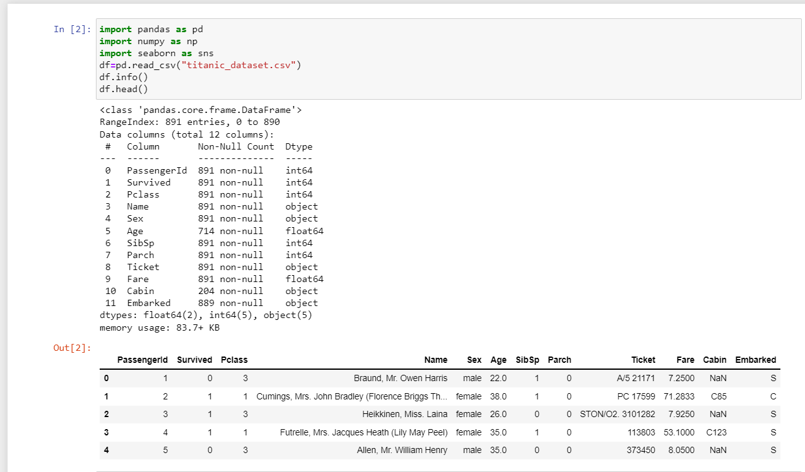
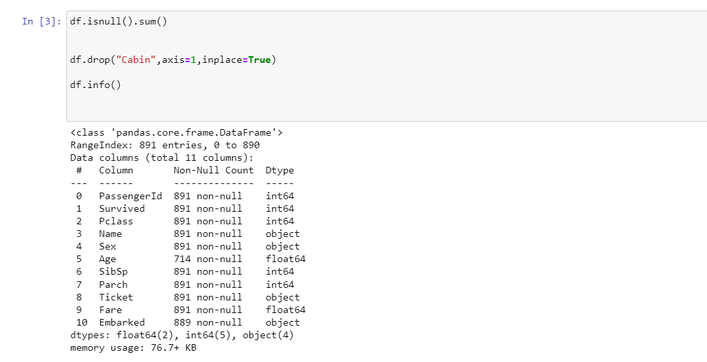
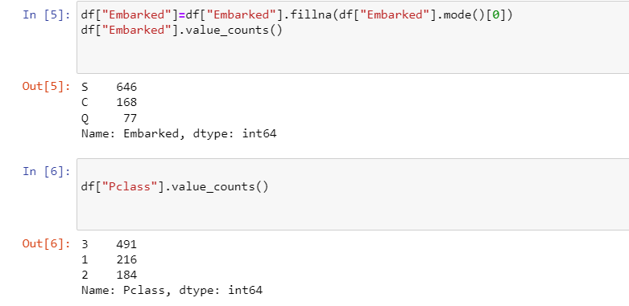
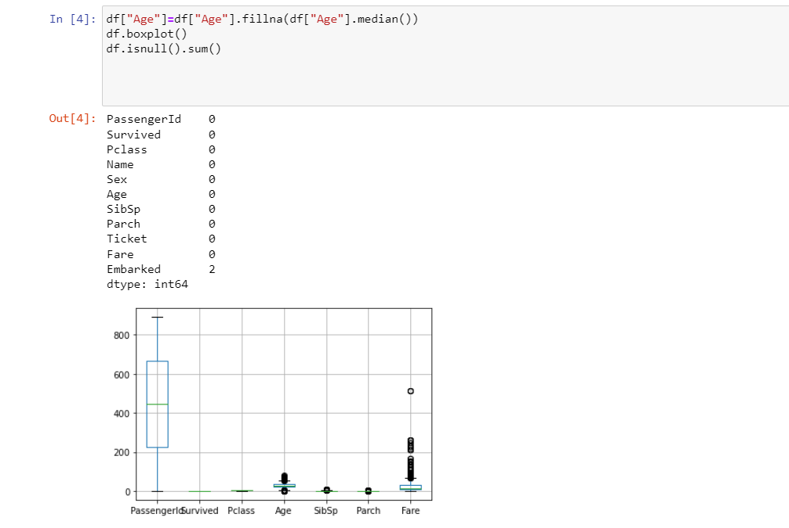
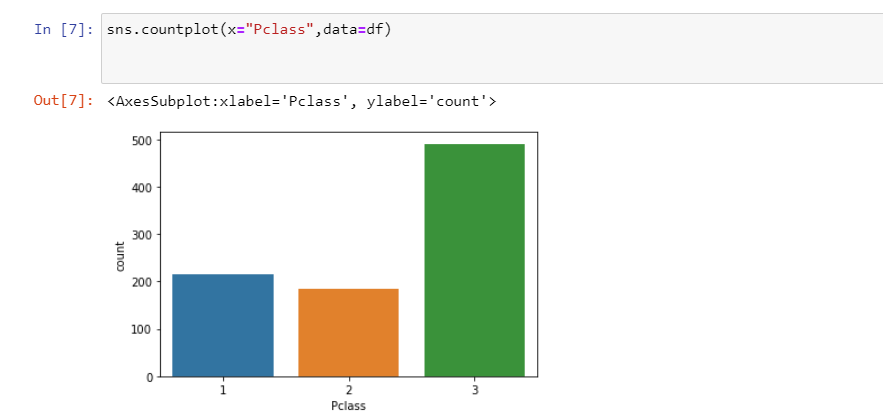
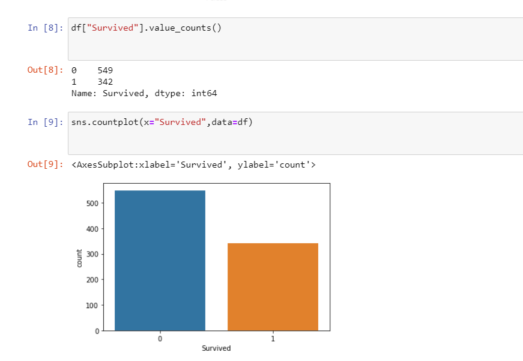
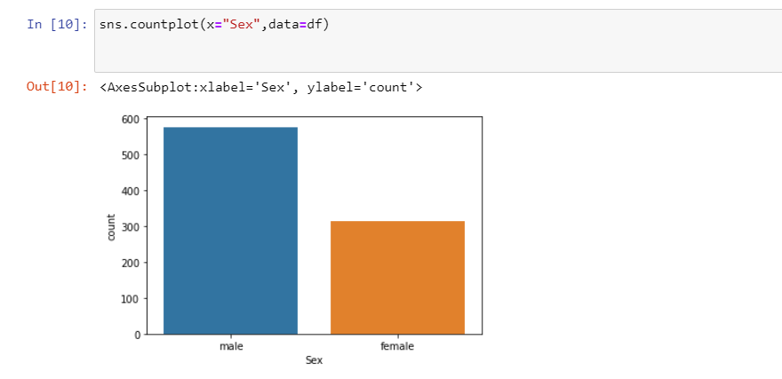
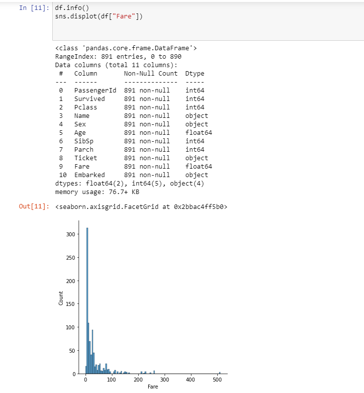
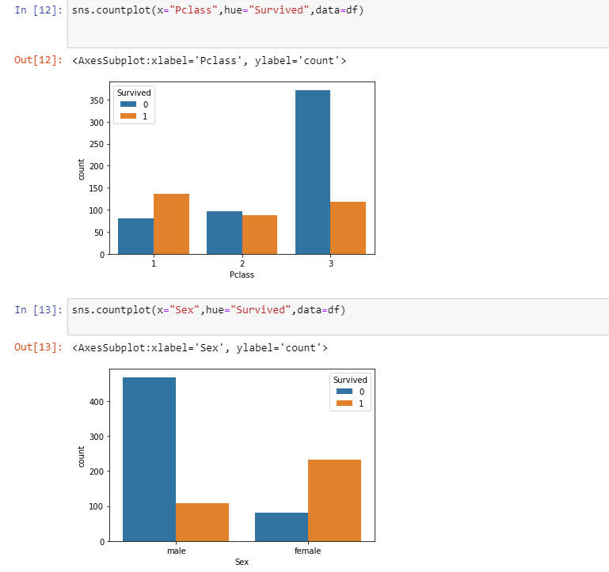
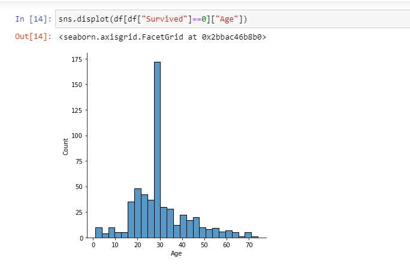
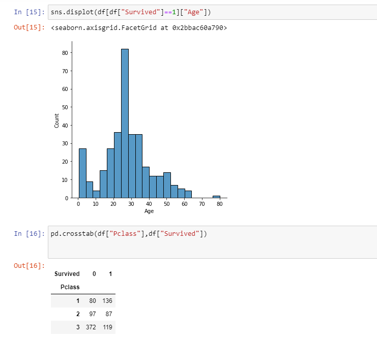
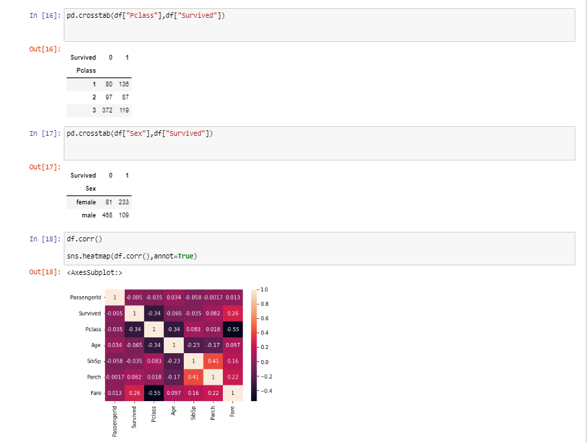
# RESULT:
EDA on the given data set is performed successfully.
